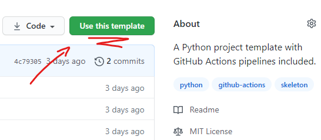
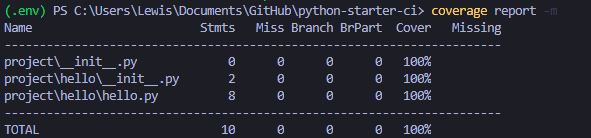

# Python Starter CI

A Python project template with GitHub Actions pipelines included.

## Introduction

This starter kit includes a GitHub Actions workflow to lint and test the project within pull requests.

This is an application of [Continuous Integration](https://www.atlassian.com/continuous-delivery/continuous-integration) (CI).


## Installation

Clone this repository (or [use it as a template](https://github.com/LloydTao/python-starter-ci/generate)), and you'll be set up with the project and pipeline.



It's that simple! GitHub Actions implements the Infrastructure as Code (IaC) principle, and picks up anything from `.github/workflows/*.yml`.

## Usage

### Linting

Lint your project using `black .`


### Testing

Run your tests using `coverage run -m pytest`


Output the test report using `coverage report -m`



### GitHub Actions

After launching a pull request, a GitHub Actions [workflow](https://github.com/LloydTao/python-starter-ci/blob/main/.github/workflows/ci-project.yml) is launched.

This will lint and test the project across Python 3.6 and 3.9, on MacOS, Ubuntu and Windows.

You can easily change the operating systems and Python versions within the pipeline's strategy matrix.

```yml
strategy:
  matrix:
    os:
      - ubuntu-latest
      - macos-latest
      - windows-latest
    python-version:
      - 3.6
      - 3.9
```

## Contributing

Pull requests are welcome. For major changes, please open an issue first to discuss what you would like to change.

Please make sure to update tests as appropriate.

## License

[MIT](https://github.com/LloydTao/python-starter-ci/blob/main/LICENSE)
